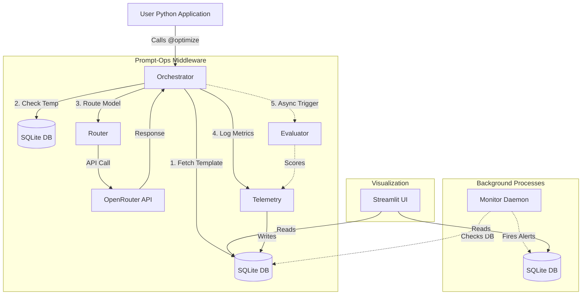

# Prompt-Ops V2

Prompt-Ops V2 is a lightweight, non-blocking Python SDK and dashboard designed to automatically optimize Large Language Model (LLM) prompts, regulate temperatures, drastically cut API costs through dynamic routing, and collect rich telemetry—all accessible via a single `@optimize` decorator.

## 🚀 What We Upgraded (From Prototype to Production)

The original V2 prototype was largely built around "dummies" and mocked functionality. Throughout our development sessions, we successfully transformed this prototype into a real, functional middleware pipeline that rivals the monolithic V1 system, but with a much sleeker architecture.

Here is a breakdown of the major upgrades:

### 1. Real LLM Telemetry & Client Integration
- **Previous State:** The system returned hardcoded strings and logged `0` tokens and `$0.00` costs.
- **Upgraded State:** Built a robust `httpx`-based `LLMClient` that calls OpenRouter APIs directly. It parses `usage` blocks from OpenAI-compatible responses, captures exact latency, and calculates fractional `$USD` costs using a centralized `MODEL_PRICING` engine. 

### 2. The Orchestrator Engine
- **Previous State:** The `@optimize` decorator was a hollow wrapper.
- **Upgraded State:** The `Orchestrator` now acts as a high-performance proxy. It intelligently intercepts user function calls, extracts the requested model, executes A/B testing logic to swap templates on the fly, dynamically tunes temperature based on historical performance, and spawns the `Evaluator` in a non-blocking `ThreadPoolExecutor` so the user's code execution is never delayed.

### 3. Background Monitoring & Auto-Retire
- **Previous State:** No active monitoring.
- **Upgraded State:** Implemented a daemon thread (`monitor.py`) that wakes up every 5 minutes to scan the local SQLite database. It automatically generates severity-based `Alerts` for latency spikes, error rates, cost overruns, and Z-score anomalies. Furthermore, poor-performing prompt versions are now automatically deactivated if their composite score drops too low.

### 4. Cascade Cost Routing
- **Previous State:** Routing logic existed but couldn't execute real LLM chains.
- **Upgraded State:** You can now pass `enable_cost_routing=True`. If an expensive model (like `gpt-4o`) is requested, the router automatically attempts the call with a cheaper model (like `gemini-2.0-flash-001`). If the cheaper model's response scores above a defined threshold, it routes the response directly to the user—saving thousands of dollars in aggregate API spend without sacrificing quality.

### 5. Premium Dashboard Rebuild
- **Previous State:** A barebones Streamlit file that crashed due to schema mismatches.
- **Upgraded State:** A stunning, dark-mode, glassmorphism-styled command center utilizing `Plotly` for interactive charts. It provides instant visibility into request volume, A/B testing metrics, quality dimension trends, total capital saved, and active system alerts.

---

## 🏗️ System Architecture

Prompt-Ops V2 uses a decoupled, event-driven architecture centered around the local SQLite database.



---

## 💻 How to Run Prompt-Ops V2

### Prerequisites
You must have Python 3.9+ installed and an OpenRouter API key.

### 1. Installation
Install the SDK in editable mode so the decorators resolve correctly:
```bash
pip install -e d:\Documents\Final_Yr_Project\v2\Prompt-Ops_V2\prompt-ops
```

### 2. Environment Setup
Set your OpenRouter API key in your terminal session:
```powershell
$env:PROMPT_OPS_API_KEY="your-api-key-here"
```

### 3. Run the Showcase Demo
We built a beautiful, colorful CLI script that sequentially demonstrates all 5 major features (Telemetry, A/B Testing, Cost Routing, Temperature Sweeps, and Background Evaluation). Run it to generate real data:
```powershell
python d:\Documents\Final_Yr_Project\v2\Prompt-Ops_V2\demo\run_showcase.py
```

### 4. Launch the Command Center Dashboard
After running the demo, boot up the dashboard to visualize the metrics and capital saved.
```powershell
python d:\Documents\Final_Yr_Project\v2\Prompt-Ops_V2\prompt-ops\prompt_ops\__main__.py dashboard
```
*(This will open an interactive Streamlit UI on `localhost:8501` in your browser).*

## Why V2 is Better Than V1
1. **Zero-Latency Critical Path:** Unlike V1, V2 pushes all heavy evaluation and logging to background threads. The developer's function returns the exact moment the LLM responds.
2. **Decorator Architecture:** V1 required developers to rewrite their logic to conform to the engine. V2 requires developers to simply add `@optimize()` above their existing functions.
3. **Local First:** All telemetry stays securely in a local SQLite database (`prompt_ops.db`), making it vastly easier to deploy and maintain than a cloud-coupled architecture.
